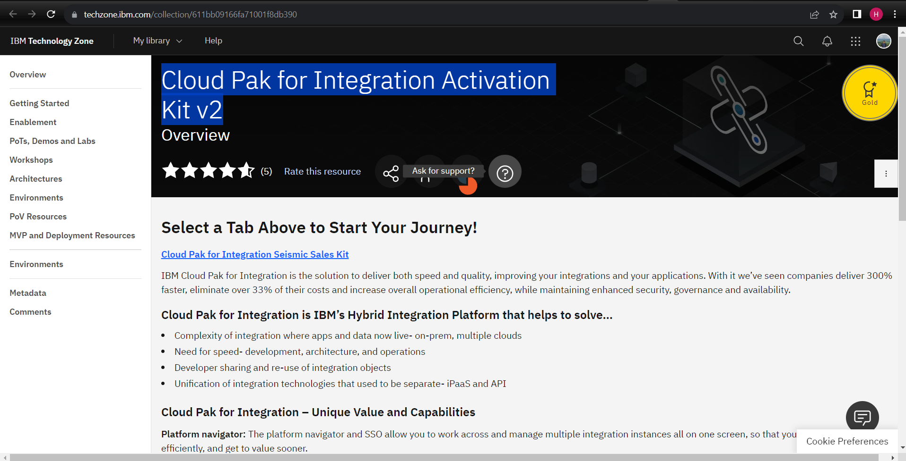
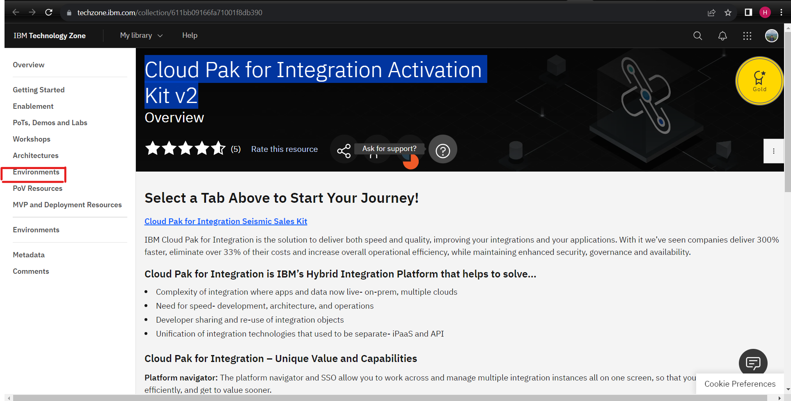
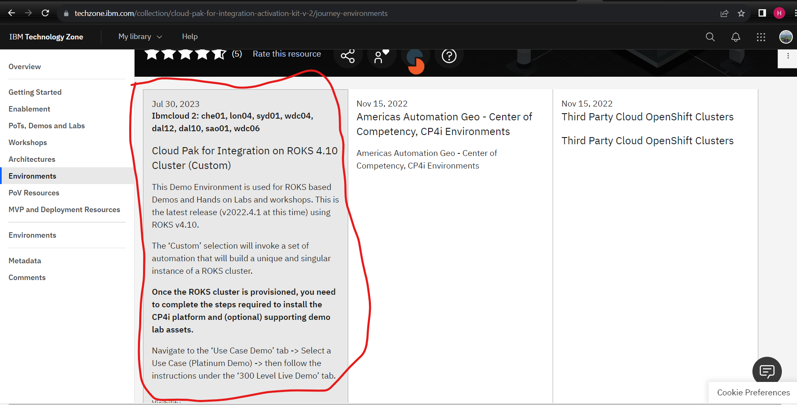
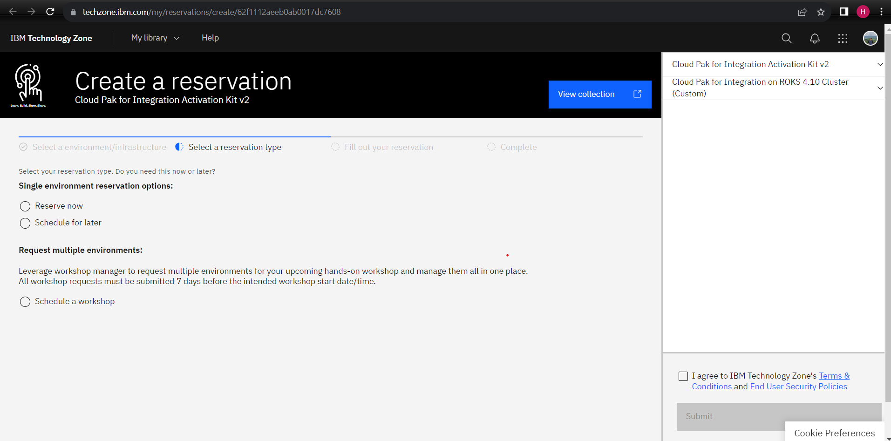
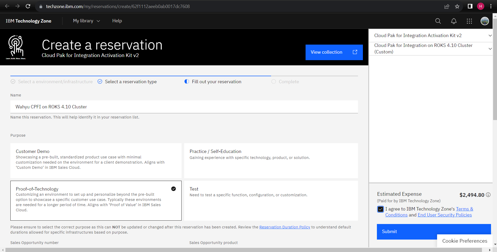
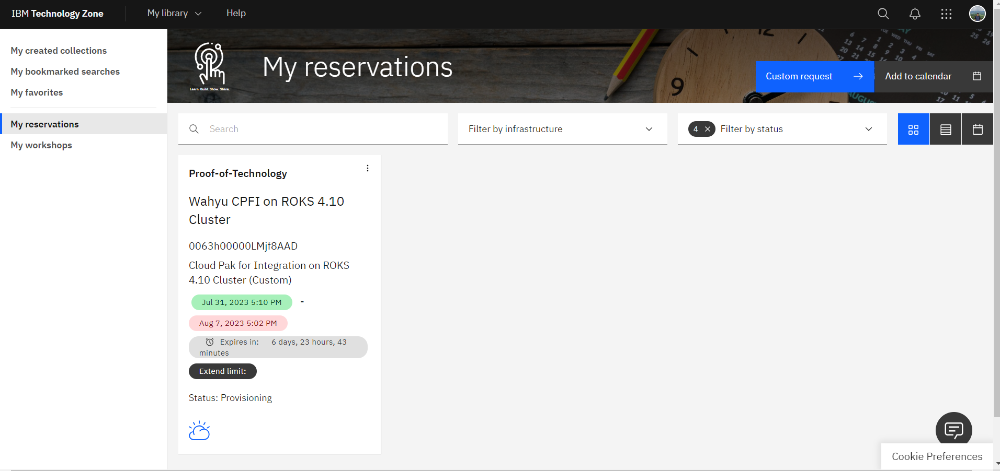

# Platform Preparation 
**Notes**: *product atau halaman web dapat berubah sewaktu-waktu tergantung perkembangan* 

Pada bagian ini proses akan dibagi menjadi 2 bagian:

1. Reservation pada [Techzone](https://techzone.ibm.com/)
2. Provisioning pada IBM Cloud
2. Konfigurasi akun pada halaman Admin Management API Connect
#

### Reservation pada Techzone
1. Buka halaman [Techzone](https://techzone.ibm.com/)

2. Pada Techzone cari di search bar atau cukup klik link berikut [**Cloud Pak for Integration Activation Kit v2**](https://techzone.ibm.com/collection/611bb09166fa71001f8db390).
Akan muncul tampilan sebagai berikut:

3. Disamping menu kiri, click **Environment**

4. Pada menu utama pilih **Cloud Pak for Integration on ROKS 4.10 Cluster (Custom)**

5. Buat reservasi, pilih **reserve now** karena kita akan langsung melakukan reserve server untuk segera dicoba.

6. Setelah masuk ke bagian **Select a reservation type** isi data pendukung
    - **Name**
        ~~~
        Wahyu CPFI on ROKS 4.10 Cluster
        ~~~
        Di bagian ini bebas anda mau memasukkan nama apa.

        **Purpose**
        ~~~
        Proof-Of-Technology
        ~~~
        Untuk product ini kita hanya dapat memakai versi untuk tujuan *proof of technology*

        **Sales Opportunity number and Sales Opportunity product**

        Untuk mendapatkan opportunity number kita dapat melihat di project ID di salesforce atau hubungi PM atau Techsales untuk mendapatkannya.
        
        **Preferred Geography**
        
        Pilih yang mana saja untuk field ini 

        **Select a Date**
        
        Pilih tanggal expiration. usahakan dibagian ini pilih tanggal yang paling jauh sehingga durasi penggunaan environment nya lama.

        Setelah diisi, click **Submit**

7. Setelah membuat reservasi, anda perlu menunggu sekitar 30 menit - 1 jam untuk proses reservasi sampai ke status **READY**.

     Silahkan cek email untuk melihat status dari reservasi atau cek halaman [My Reservation](https://techzone.ibm.com/my/reservations)
     
8. Ketika reservasi anda sudah pada status **READY** tahap ini selesai. 