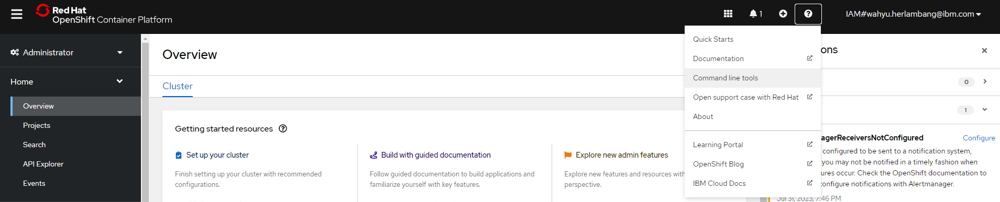
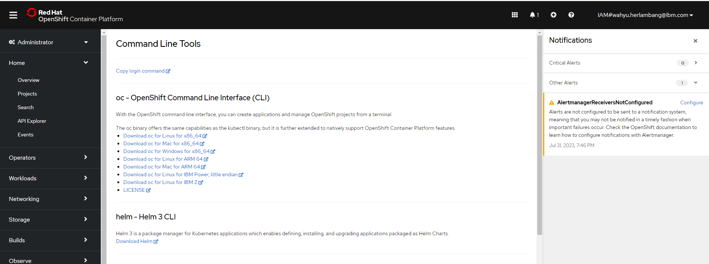
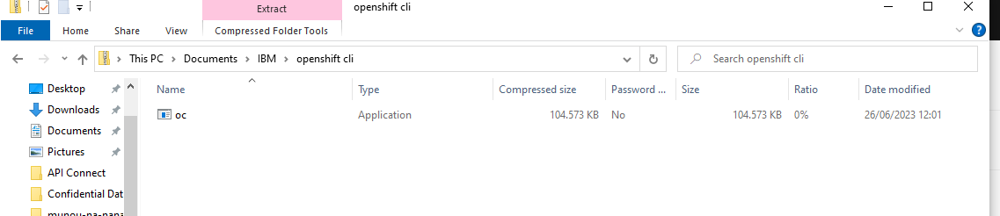
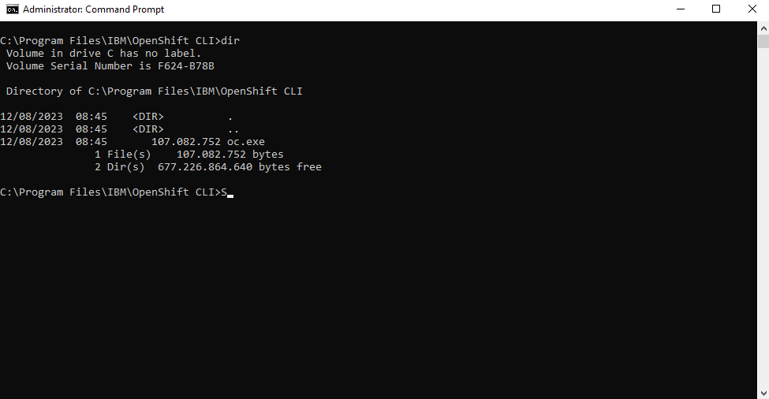
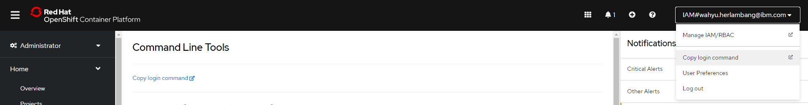
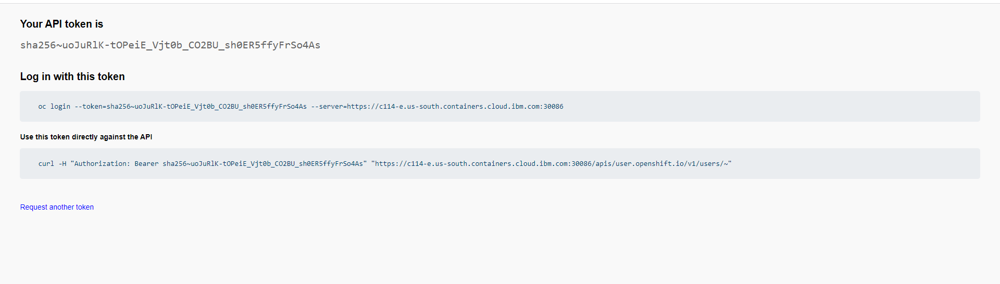
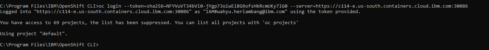

# Installasi API Connect Menggunakan Techzone 
**Notes**: *product atau halaman web dapat berubah sewaktu-waktu tergantung perkembangan* 

Pada bagian ini proses akan dibagi menjadi 4 bagian:

1. [Reservation IBM Cloud pada Techzone](https://github.com/5112100070/apic-lab/tree/master/preparation/part-1.md)
2. [Installasi CP4I pada IBM Cloud](https://github.com/5112100070/apic-lab/tree/master/preparation/part-2.md)
3. [Installasi API Connect melalui CP4I](https://github.com/5112100070/apic-lab/tree/master/preparation/part-3.md)
4. [Konfigurasi standart API Connect](https://github.com/5112100070/apic-lab/tree/master/preparation/part-4.md)

Dimana seluruh bagian perlu dilakukan sampai berhasil.
#

# Notes
### Akses Techzone OCP CLI
1. Jika kamu sudah memiliki OCP di Techzone. Pada dashboard OCP, klik icon "?". Pilih **Command line tools**

2. Pada halaman Command Line Tools, pilih **ocp cli** sesuai dengan kondisi komputer anda.

3. Jika anda menggunakan Windows, download untuk versi windows.
Extract hasil download sehingga muncul file sebagai berikut.

4. Buka terminal cmd, dan masuk ke folder tempat hasil extraksi file

5. Untuk login dari localhost komputermu ke server ocp techzone, anda bisa akses lewat dashboard OCP. Klik pada nama akun profilmu -> muncul drop down -> klik **Copy login command** 
 
6. Berikutnya akan muncul halaman tentang command untuk login ke OCP Techzone anda

7. Setelah itu buka terminal dan arahkan ke tempat anda menaruh binary ocp (langkah 4). Jalankan command sesuai perintah halaman.
 
Akan muncul pesan sukses seperti berikut.

## Contact 
📧 Email: [wahyu.herlambang@ibm.com](mailto:contoh@email.com)

💬 Slack: [wahyu.herlambang](https://ibm-indonesia.slack.com/archives/D04K0BJETUK)
