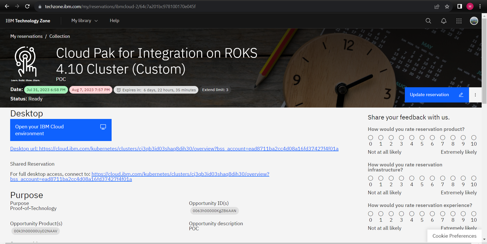
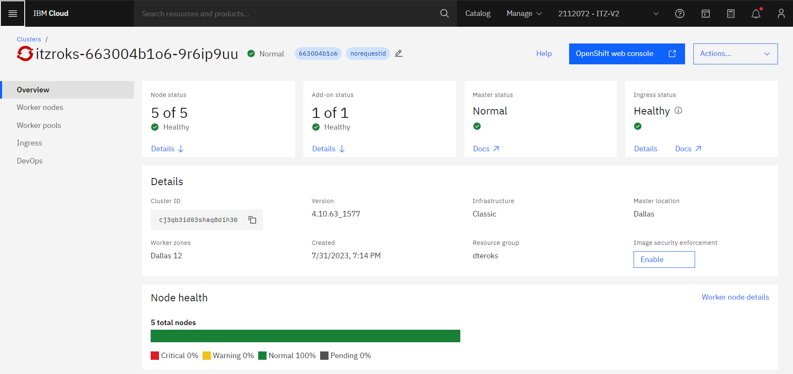
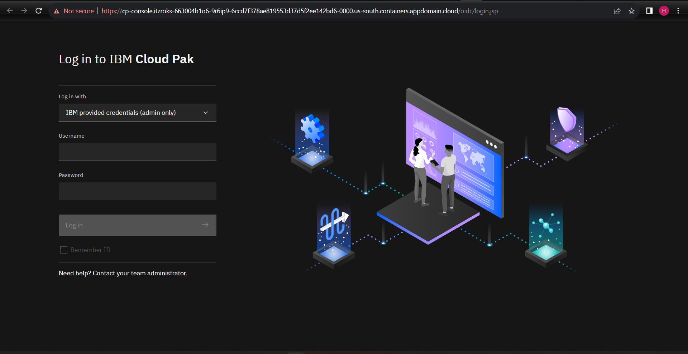

# Platform Preparation 
**Notes**: *product atau halaman web dapat berubah sewaktu-waktu tergantung perkembangan* 

Pada bagian ini proses akan dibagi menjadi 2 bagian:

1. Reservation pada [Techzone](https://techzone.ibm.com/)
2. Provisioning CP4I pada IBM Cloud
2. Konfigurasi akun pada halaman Admin Management API Connect
#

### Reservation pada Techzone
1. Buka halaman [Techzone](https://techzone.ibm.com/)

2. Pada Techzone cari di search bar atau cukup klik link berikut [**Cloud Pak for Integration Activation Kit v2**](https://techzone.ibm.com/collection/611bb09166fa71001f8db390).
Akan muncul tampilan sebagai berikut:

3. Disamping menu kiri, click **Environment**

4. Pada menu utama pilih **Cloud Pak for Integration on ROKS 4.10 Cluster (Custom)**

5. Buat reservasi, pilih **reserve now** karena kita akan langsung melakukan reserve server untuk segera dicoba.

6. Setelah masuk ke bagian **Select a reservation type** isi data pendukung
    - **Name**
        ~~~
        Wahyu CPFI on ROKS 4.10 Cluster
        ~~~
        Di bagian ini bebas anda mau memasukkan nama apa.

        **Purpose**
        ~~~
        Proof-Of-Technology
        ~~~
        Untuk product ini kita hanya dapat memakai versi untuk tujuan *proof of technology*

        **Sales Opportunity number and Sales Opportunity product**

        Untuk mendapatkan opportunity number kita dapat melihat di project ID di salesforce atau hubungi PM atau Techsales untuk mendapatkannya.
        
        **Preferred Geography**
        
        Pilih yang mana saja untuk field ini 

        **Select a Date**
        
        Pilih tanggal expiration. usahakan dibagian ini pilih tanggal yang paling jauh sehingga durasi penggunaan environment nya lama.

        Setelah diisi, click **Submit**

7. Setelah membuat reservasi, anda perlu menunggu sekitar 30 menit - 1 jam untuk proses reservasi sampai ke status **READY**.

     Silahkan cek email untuk melihat status dari reservasi atau cek halaman [My Reservation](https://techzone.ibm.com/my/reservations)
     
8. Ketika reservasi anda sudah pada status **READY** tahap ini selesai.

#
### Provisioning CP4I pada IBM Cloud
Tahap ini dilakukan untuk mempersiapkan environment CP4I terlebih dahulu sebelum penginstallan API CONNECT.
1. Buka halaman detail dari My reservation dengan mengclick reservasimu.  

2. Click link untuk akses **Desktop Url** untuk mengakses halaman home page.

3. Login halaman IBM Cloud dengan IBM ID anda.

4. Pada searchbar cari **Cloud Pak for Integration** dan pilih.

5. Pada halaman **Cloud Pak for Integration** isi spesifikasi yang kamu inginkan. Pada untuk value yang penting bisa diisi:
~~~
Product Version: 
    pilih yang terbaru
Select a project:
    click add project dan masukkan value cp4i
csDefaultAdminPassword:
    perhatikan password harus 32 karakter dan terdiri dari huruf dan angka (Error baru muncul saat proses provisioning)

(di tab optional input variable)
    Isi dengan mailtrap.io yang anda sudah buat
    demoAPICMailServerHost: sandbox.smtp.mailtrap.io
    demoAPICMailServerPort: 2525
    demoAPICEMailAddress: wahyu.herlambang@example.com
    demoAPICEServerUsername: username servermu
    demoAPICEServerPassword: password servermu
~~~
Ketika selesai mengisi seluruh kelengkapan data, centang aggrement dan click **Install**

6. Proses Installasi dimulai, kita tunggu beberapa saat sampai selesai. 

**notes** *:Pada tahap ini kadang provisioning kerap terjadi kegagalan. Apabila terjadi, maka anda jangan ragu untuk ulang kembali.* 
7. Ketika sudah selesai klik tombol **Offering Dashboard**

8. Pada tahap ini anda telah berhasil melakukan installasi CP4I
