# Bagaimana cara membuka akses CLI pada kluster kafka di CP4I dari Techzone
Kita diberi akses untuk menggunakan cli dari hasil provisioning Techzone. Untuk mendapatkan akses techzone kafka. Berikut hal-hal yang  diperlukan:    
1. [Akses Cli ke Openshift Container dari Techzone](#akses-techzone-ocp-cli)
2. [Install CloudPak Cli](#install-cloudpak-cli-cloudctl)
2. [Cara Install dan akses kafka menggunakan CLI](#cara-install-dan-akses-kafka-menggunakan-cli)


## Akses Techzone OCP CLI
1. Jika kamu sudah memiliki OCP di Techzone. Pada dashboard OCP, klik icon "?". Pilih **Command line tools**
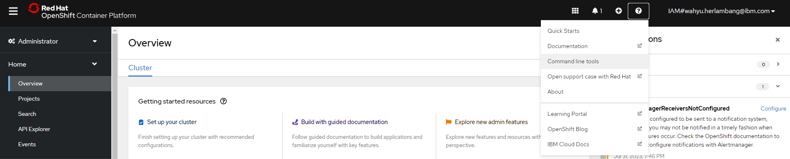
2. Pada halaman Command Line Tools, pilih **ocp cli** sesuai dengan kondisi komputer anda.
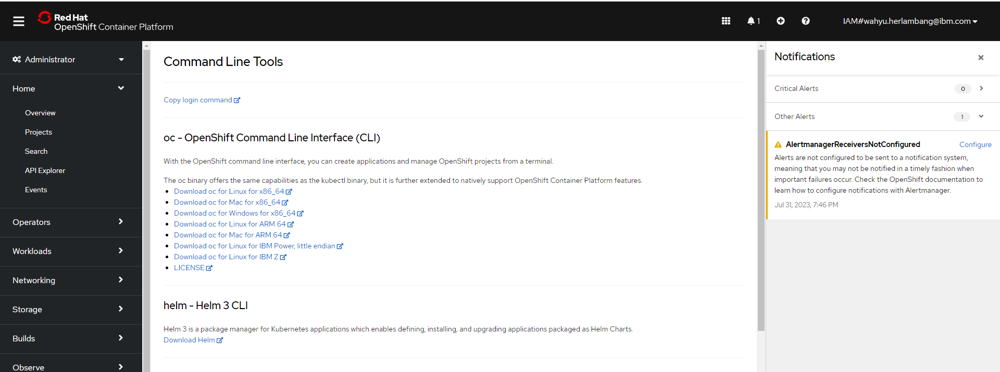
3. Jika anda menggunakan Windows, download untuk versi windows.
Extract hasil download sehingga muncul file sebagai berikut.
Cara penggunaan selain windows hampir sama. 
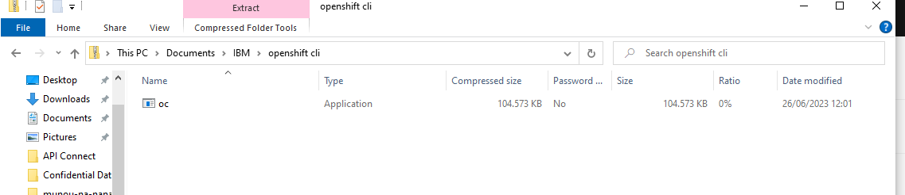
4. Buka terminal cmd, dan masuk ke folder tempat hasil extraksi file
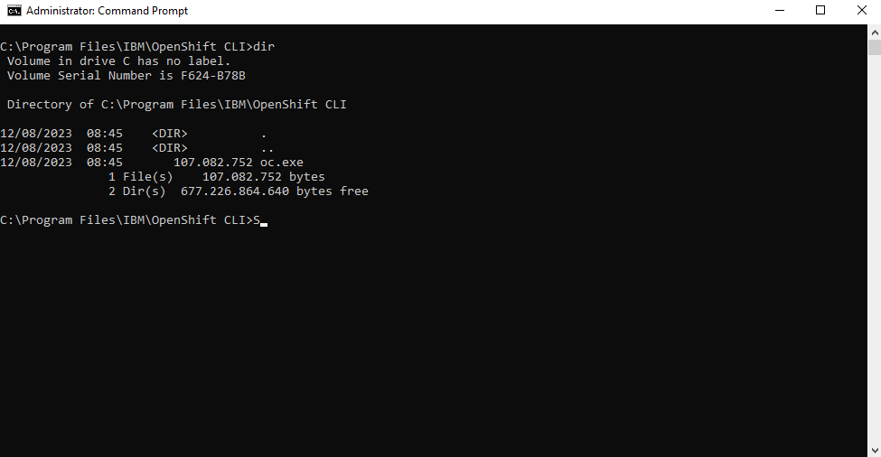
5. Untuk login dari localhost komputermu ke server ocp techzone, anda bisa akses lewat dashboard OCP. Klik pada nama akun profilmu -> muncul drop down -> klik **Copy login command** 
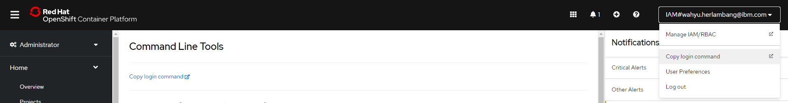 
6. Berikutnya akan muncul halaman tentang command untuk login ke OCP Techzone anda
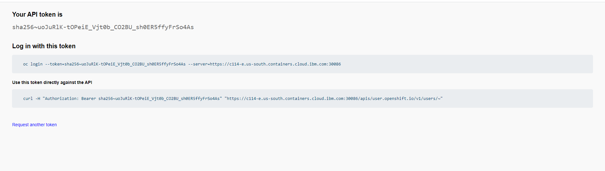
7. Setelah itu buka terminal dan arahkan ke tempat anda menaruh binary ocp (langkah 4). Jalankan command sesuai perintah halaman.
 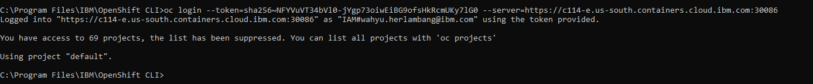
Akan muncul pesan sukses seperti berikut.
#

## Install CloudPak Cli (cloudctl)
Tutorial ini adalah installasi untuk mengakses CloudPak menggunakan command line.
1. Untuk installasi cloudpak cli, anda bisa masuk ke akun [github](https://github.com/IBM/cloud-pak-cli#overview). Untuk detail installasi nya.
2. CloudPak Cli hanya support untuk MacOS dan Linux system. Disini pengguna akan menggunakan Linux OS.
3. Gunakan command 
```
    curl -L https://github.com/IBM/cloud-pak-cli/releases/latest/download/cloudctl-linux-amd64.tar.gz -o cloudctl-linux-amd64.tar.gz
    curl -L https://github.com/IBM/cloud-pak-cli/releases/latest/download/cloudctl-linux-amd64.tar.gz.sig -o cloudctl-linux-amd64.tar.gz.sig
```  
4. Setelah berhasil di download. Extract hasil downloadnya.
5. Disana terdapat binary cloudctl, pindahkan file binarynya ke **/usr/local/bin** agar command lebih mudah dijalankan.
6.  Cek Versi dari cloudctl dengan 
```
cloudctl version
```
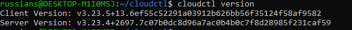

7. Setelah langkah ini, pastikan anda sudah login OCP pada [langkah 1](#akses-techzone-ocp-cli).
8. Cari tau dimana server cloudpak 
```
    oc get route -n ibm-common-services
```
atau 
```
    oc get route -n ibm-common-services cp-console -o jsonpath=‘{.spec.host}’
```
akan mendapatkan hasil dimana lokasi route dari cp-console. Pada tutorial ini cp-console memang ditempatkan namespace ibm-common-services. Pada real case hal ini bisa berbeda.
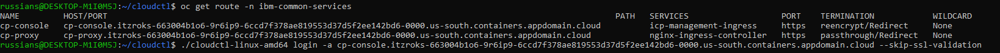

9. Login CloudPak melalui command cli.
```
    cloudctl login -a <<LOKASI route cp-console>> --skip-ssl-validation
```
Anda kan ditanya username, password, dan namespace yang anda sudah buat dari CloudPak. Namespace adalah target project yang ingin di-targetkan dari cli.
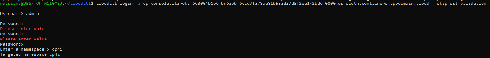
10. Pada tahap ini anda sudah dapat mengakses source dari namespace anda.

#

## Cara Install dan akses kafka menggunakan CloudCtl CLI
1. Buka halaman **Toolbox** pada sub menu. Cari bagian *IBM Event Streams command-line interface*. 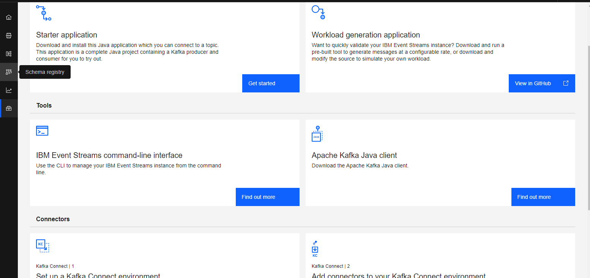
2. Pada halaman tersebut anda akan diminta untuk mendownload plugin ES(Event Stream). Plugin tersebut harus diinstall menggunakan command dari cloudctl(CloudPak Cli). (Pastikan anda sudah login pada cloudctl)
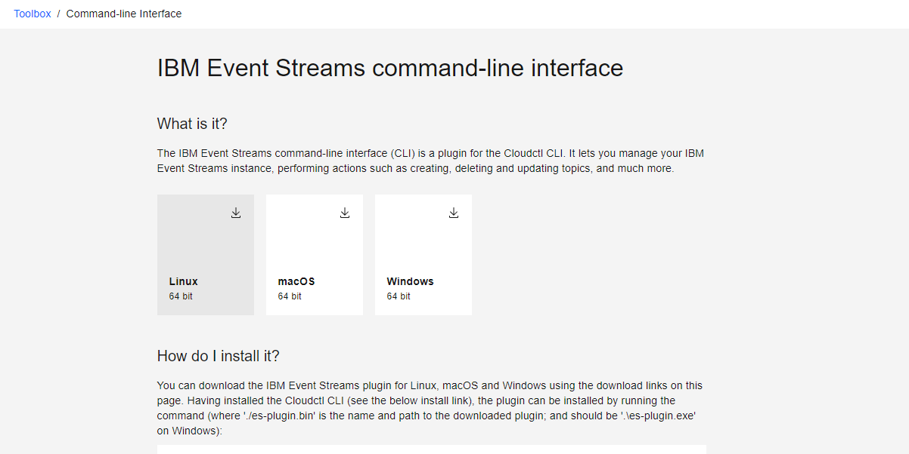
3. Pada terminal jalankan command
```
    CLOUDCTL_TRACE=true cloudctl plugin install ./kubectl-es-plugin.bin
```
Perintah ini akan menjalankan installasi dan menampilkan log-nya.
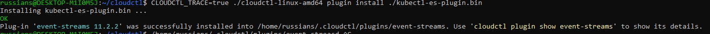
4. Cek hasil installasi plugin dengan command
```
    cloudctl plugin show event-streams
```
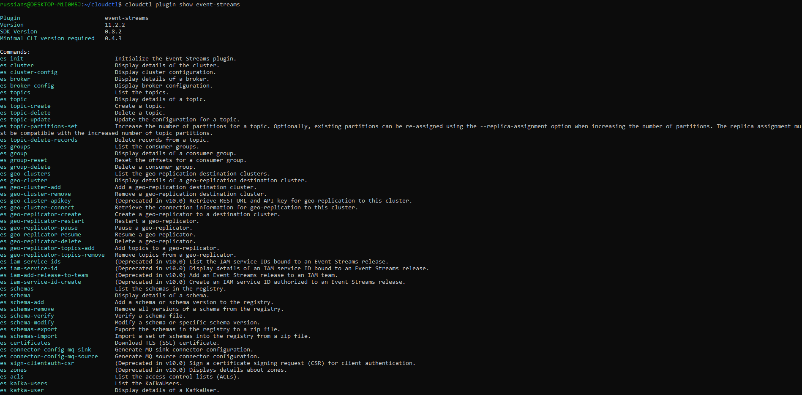
5. Akses cluster kafka dengan command
```
    cloudctl es init
```
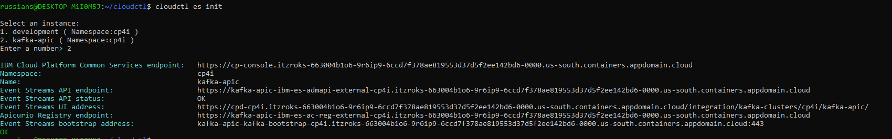
Disini akan menampilkan list dari cluster yang ada di cp4i
6. Pada tahap ini anda sudah dapat mengakses kafka melalui CLI.