# Installasi Platform Cluster Kafka
Kafka adalah platform streaming data open-source yang dirancang untuk mengatasi masalah streaming data secara skalabel dan tahan lama (durable).

Berikut merupakan langkah untuk installasi kafka dengan platform **CP4i**. Apabila anda belum memiliki platform CP4I bisa mengikuti tutorial [berikut](https://github.com/5112100070/apic-lab/tree/master/preparation)(Ikuti (langkah 1 sampai 2).

Berikut adalah langkah untuk installasi Kluster Kafka pada CP4I:

1. Login pada CP4I anda terlebih dahulu.
 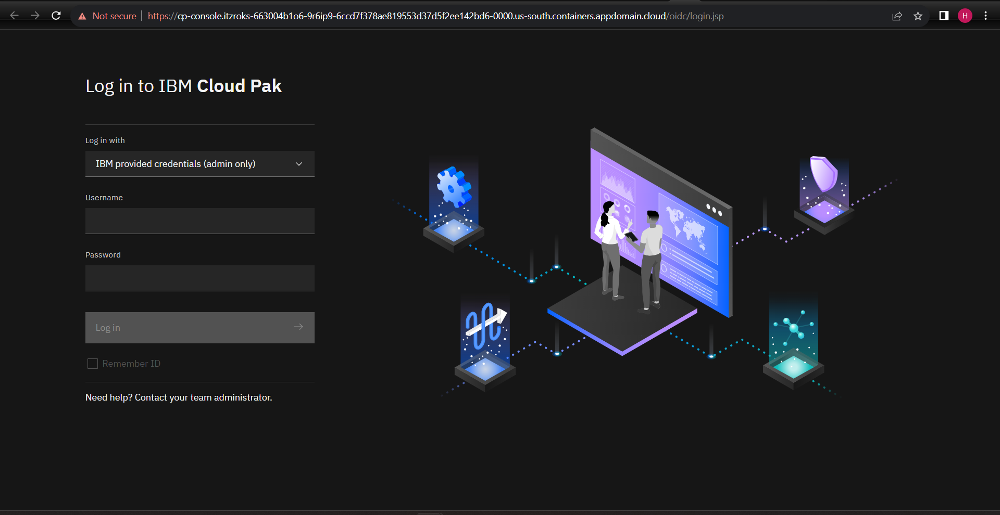
2. Setelah login pada sub menu yang ada disamping kiri, klik **Run** -> **Kafka Clusters**
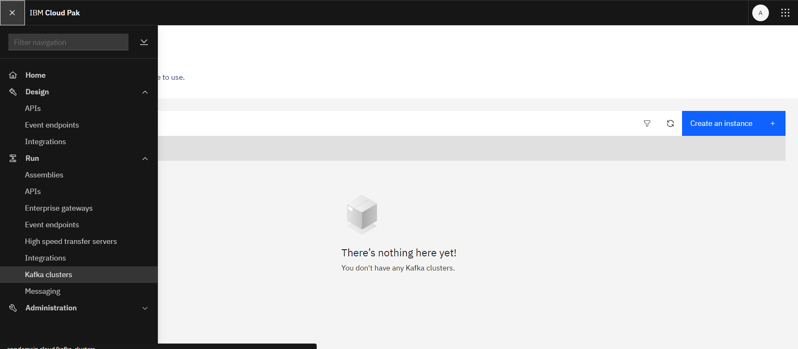
3. Setup kafka cluster yang anda inginkan.
Pada kasus yang saya inginkan, saya menggunakan **Production 3 Brokers** 
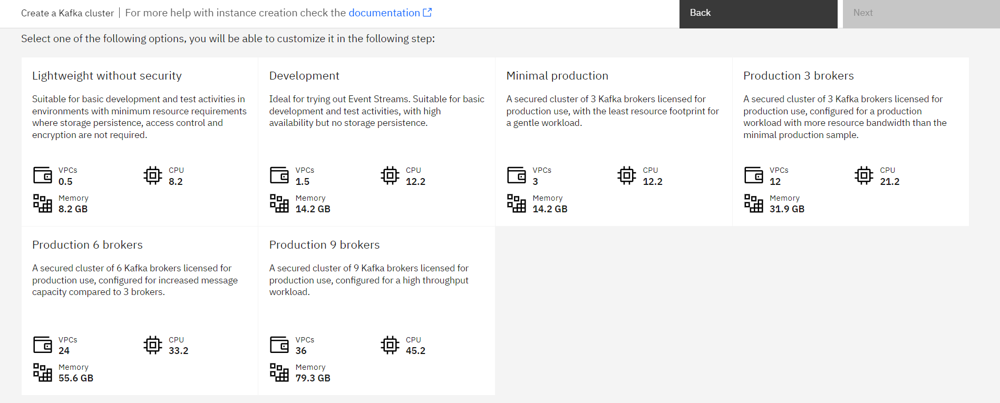
4. Setting detail kafka yang diinginkan

    Konfigurasi bersifat bebas. Namun, perlu diperhatikan saat memilih storage untuk penyimpanan harus dalam kategori **match** 
    Anda dapat membuat ClassStorage khusus untuk kafka. contoh [template](../../Misc/yaml-backup/kafka-techzone-storageclass.yaml).
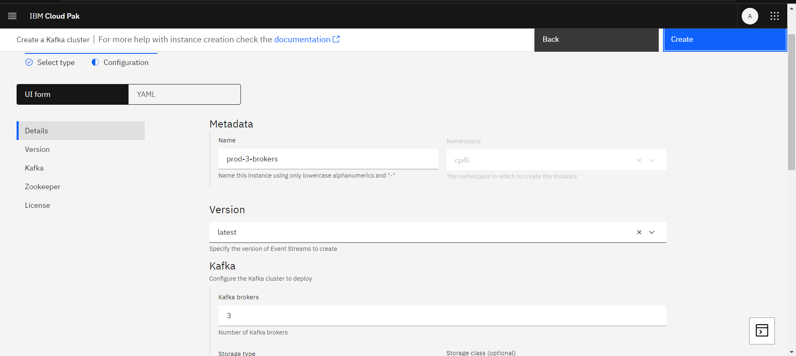
5. Anda akan otomatis di redirect ke halaman proses provisioning. Tunggu hingga proses selesai
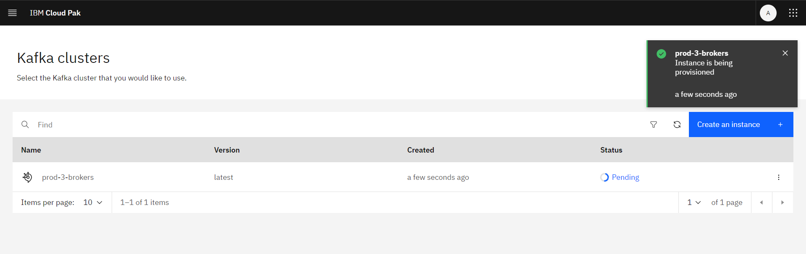
6. Ketika selesai dan sukses. Nama dari kluster menjadi dapat di-klik. Klik untuk masuk ke dalam dashboard CP4I Kafka 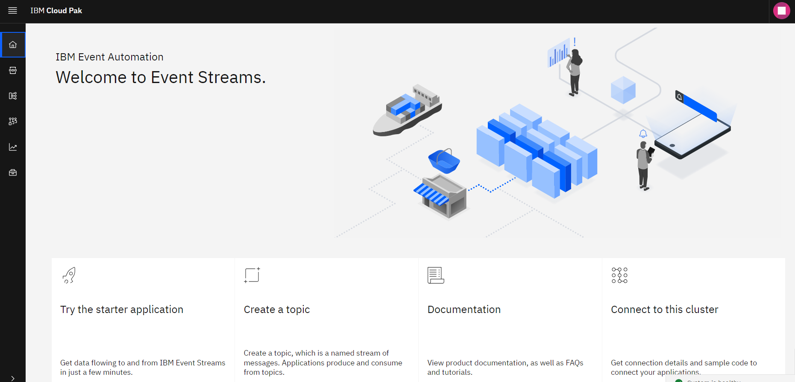
 
## Fixing Bug error unknown Ketika provisioning Kafka
Ketika menggunakan provisioning kafka di CP4I di kita ada kemungkinan mendapatkan kasus dimana **error unknown**. 
Seperti pada gambar. 
Hal ini bisa disebabkan karena kafka atau zookepeer tidak dapat meng-*claim* sebuah blok storage.
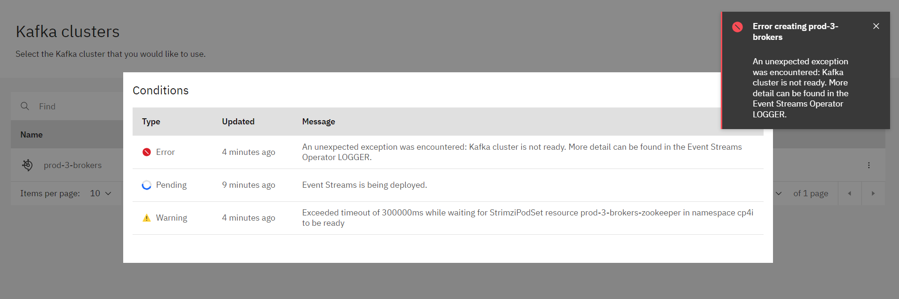

Untuk men-solve nya dapat dilakukan dengan langkah berikut:

1. Buka dashboard openshift yang diberi ke kita saat pertama kali melakukan reservasi.
Buka Techzone -> My Reservation -> Pilih reservasi anda.
 
    [Dashboard ini anda dapatkan ketika preparasi langkah no.1](https://github.com/5112100070/apic-lab/tree/master/preparation/part-1.md)
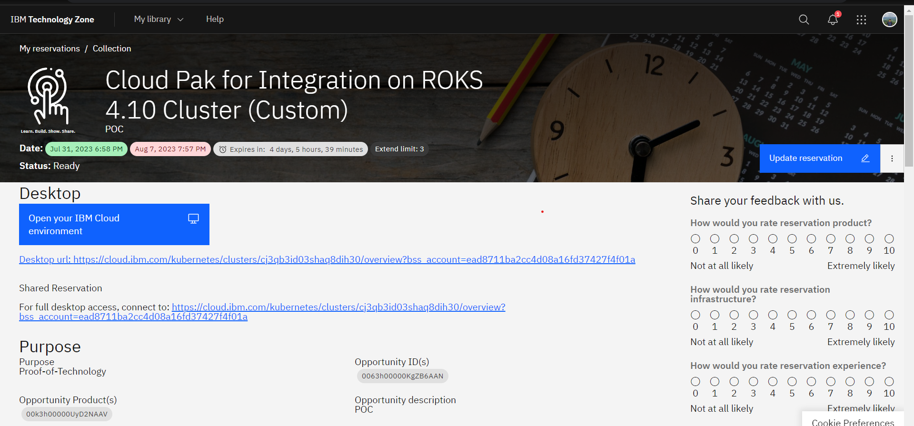
2. Klik link **Desktop Url** atau **For full desktop access, connect to**. Anda akan di-*redirect* ke halaman **cluster IBM Cloud**. Klik tombol **Openshift web console**.
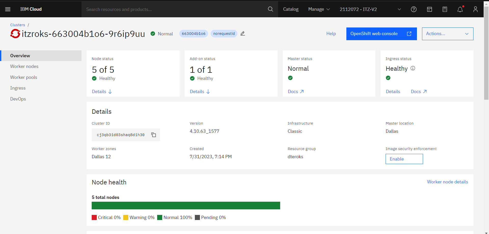
3. Anda akan di-redirect ke halaman **Openshift Dashboard Consol**
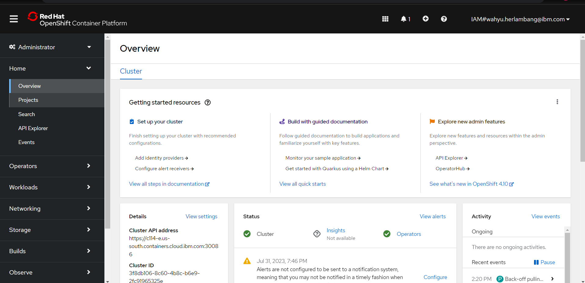
4. Pada web console ini kita akan melakukan debug event apa yang menyebabkan Error saat provisioning Kafka.

    Klik **Home** -> **Events**
    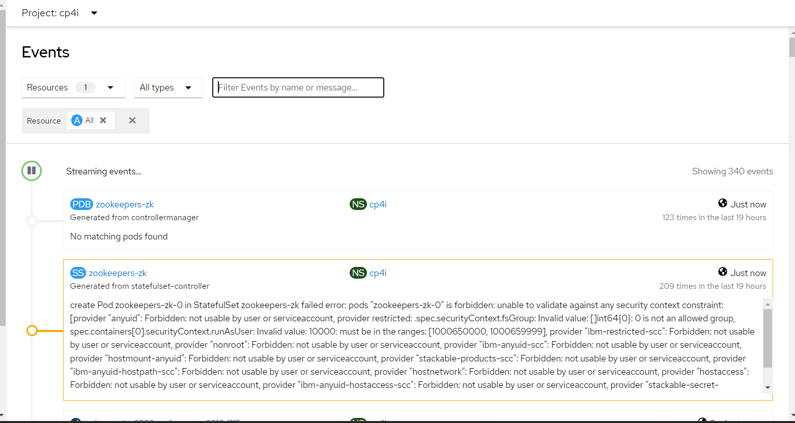
    Pada halaman ini anda dapat melihat apa penyebab kafka gagal di-provisioning.
    
    Pada kasus ini, saya terkena error karena storage zookeper tidak terdefinisi dengan baik pada system bawaan(persistent volume di-set dengan nama *enter-storage-class-name-here*).
    Dan konfigurasi ini tidak dapat diubah.
    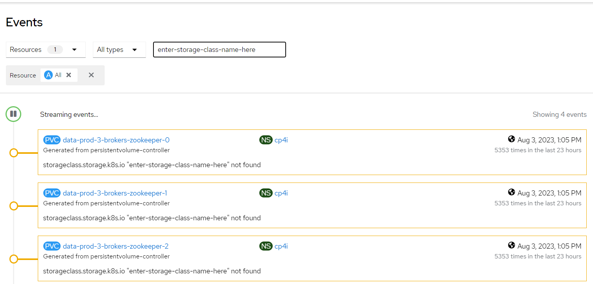
5. Ada 2 cara untuk menyelesaikan cara ini.        
    1. Uninstall Kafka lama dan gunakan template [yaml](../../Misc/yaml-backup/kafka-techzone.yaml).
    2. Buat Storage class baru.   
    Pada dokument ini penulis akan menggunakan cara ke-2 karena lebih cepat dan simple.

6. Buka menu **Storage** -> **StorageClasses**. Klik Tombol **Create StorageClass**
Gunakan [yaml](../../Misc/yaml-backup/kafka-techzone-storageclass.yaml) ini ke dalam konfigurasi.

7. Ulangi langkah untuk installasi Kafka. Dan pilih StorageClass yang tadi telah didefinisikan saat membuat kafka cluster.
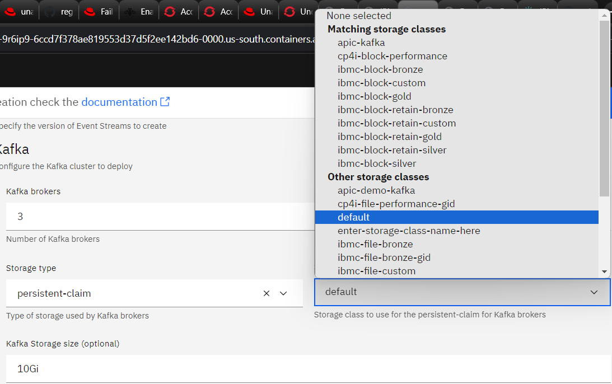
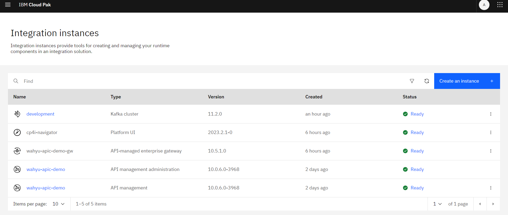