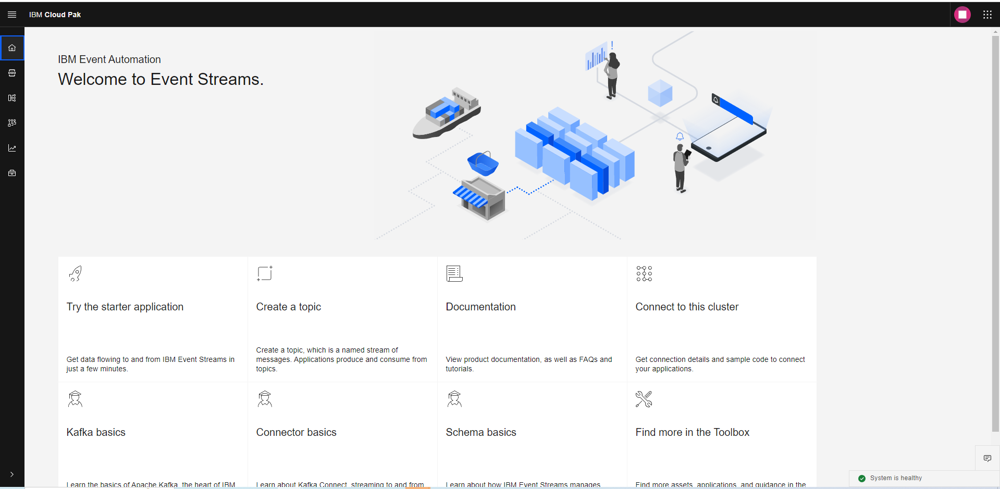
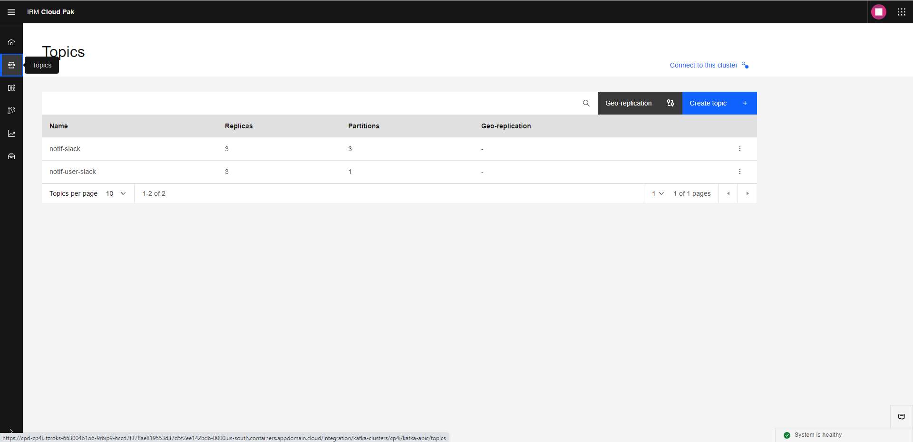
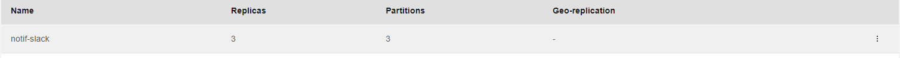
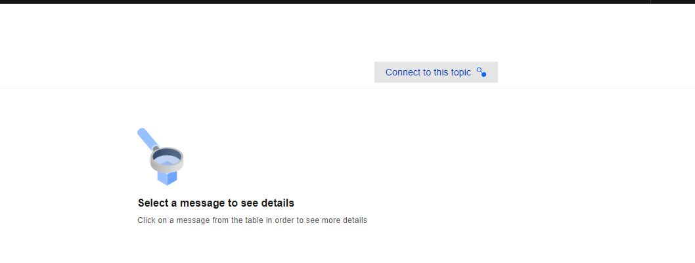
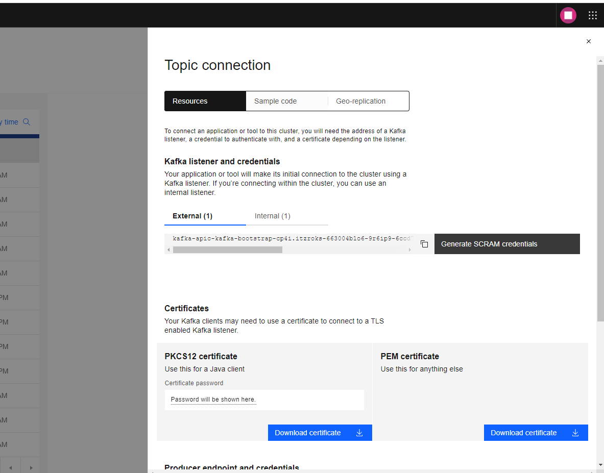
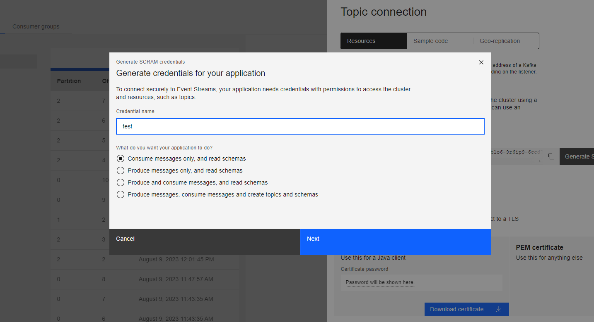
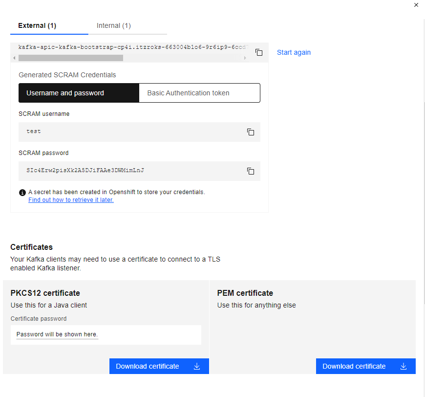

# Bagaimana cara menyiapkan konfigurasi Produser Kafka
pada dokumentasi ini, penulis akan menjelaskan metode-metode apa saja yang dapat digunakan untuk melakukan koneksi ke kafka

## Proses melihat detail konfigurasi
1. Buka dashboard kafka pada CP4I

2. Klik Topics pada submenu

3. Klik nama topik yang ingin kamu sambungkan

4. Tekan tombol **Connect to this topic**

5. Sistem akan memperlihatkan tentang beberapa metode untuk membuat koneksi

## Cara menyambungkan kafka menggunakan listener dan credentials
Saat menggunakan listener, kafka akan di konsumsi secara Real-time Streaming dan Ordered data.
Cara implementasinya sebagai berikut:
1. Klik Generate SCRAM credentials pada bagian **Kafka listener dan credentials**.

2. Berikutnya Isi apa yang anda ingin gunakan pada producer itu dan set konfig topik-topik nya.
3. Data-data yang akan dipakai adalah sebagai berikut:
    - username
    - password
    - PEM Certificate

4. Untuk implementasinya dapat dilihat pada [code golang](https://github.com/5112100070/apic-demo/blob/master/cmd/internal/kafka.go#L17).