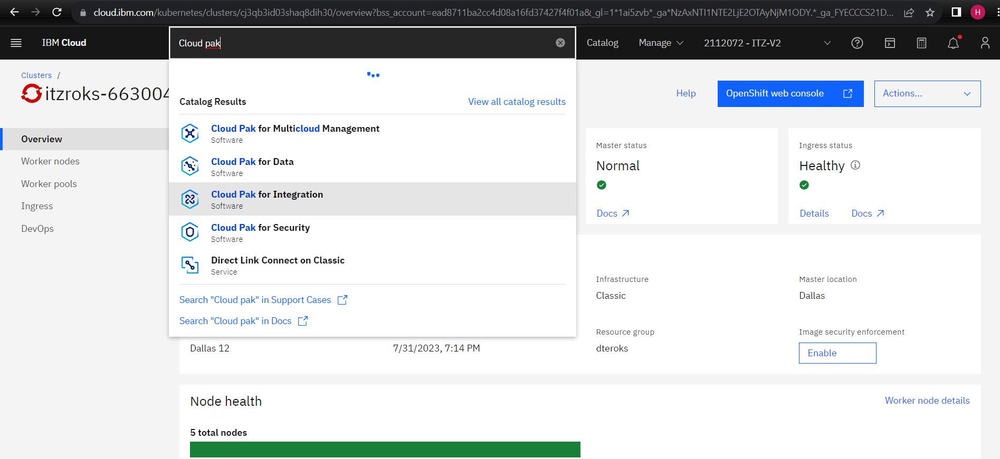

### Provisioning CP4I pada IBM Cloud
Tahap ini dilakukan untuk installasi CP4I pada IBM Cloud yang sudah direservasi.
1. Buka halaman detail dari My reservation dengan mengclick reservasimu.  

2. Click link untuk akses **Desktop Url** untuk mengakses halaman home page.

3. Login halaman IBM Cloud dengan IBM ID anda.

4. Pada searchbar cari **Cloud Pak for Integration** dan pilih.

5. Pada halaman **Cloud Pak for Integration** isi spesifikasi yang kamu inginkan. Pada untuk value yang penting bisa diisi:
~~~
Product Version: 
    pilih yang terbaru
Select a project:
    click add project dan masukkan value cp4i
csDefaultAdminPassword:
    perhatikan password harus 32 karakter dan terdiri dari huruf dan angka (Error baru muncul saat proses provisioning)

(di tab optional input variable)
    Isi dengan mailtrap.io yang anda sudah buat
    demoAPICMailServerHost: sandbox.smtp.mailtrap.io
    demoAPICMailServerPort: 2525
    demoAPICEMailAddress: wahyu.herlambang@example.com
    demoAPICEServerUsername: username servermu
    demoAPICEServerPassword: password servermu
~~~
Ketika selesai mengisi seluruh kelengkapan data, centang aggrement dan click **Install**

6. Proses Installasi dimulai, kita tunggu beberapa saat sampai selesai. 

**notes** *:Pada tahap ini kadang provisioning kerap terjadi kegagalan. Apabila terjadi, maka anda jangan ragu untuk ulang kembali.* 
7. Ketika sudah selesai klik tombol **Offering Dashboard**

8. Pada tahap ini anda telah berhasil melakukan installasi CP4I
