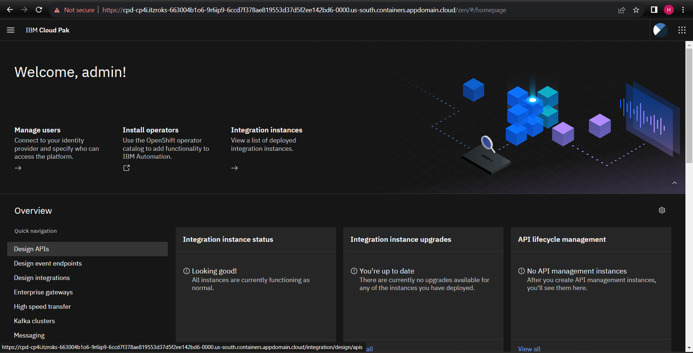

# Installasi API Connect melalui CP4I
Tahap ini merupakan installasi API Connect menggunakan CP4I
1. Setelah mendapatkan akses ke CP4I. Login-lah menggunakan username dan password yang digunakan saat installasi **CP4I** dari **IBM Cloud**.

2. Setelah login anda akan masuk ke halaman utama CP4I

3. Klik Design API pada sub menu disamping kiri

4. Pada halaman design API klik **Create an instance** 

5. Isi kebutuhan server sesuai kebutuhan

6. Setelah selesai mengisi kebutuhan instance, silahkan tunggu provisioning API Connect sampai selesai.

7. Setelah selesai dan server berstatus **Ready**, klik header home **IBM Cloud Pak**

8. Installasi selesai dengan muncul 4 service instance yang telah dibuat, diantaranya:
    
    1. API-managed enterprise gateway
    2. API management administration
    3. API management
    4. Platform UI

#

### Selamat Anda berhasil menginstall IBM API Connect