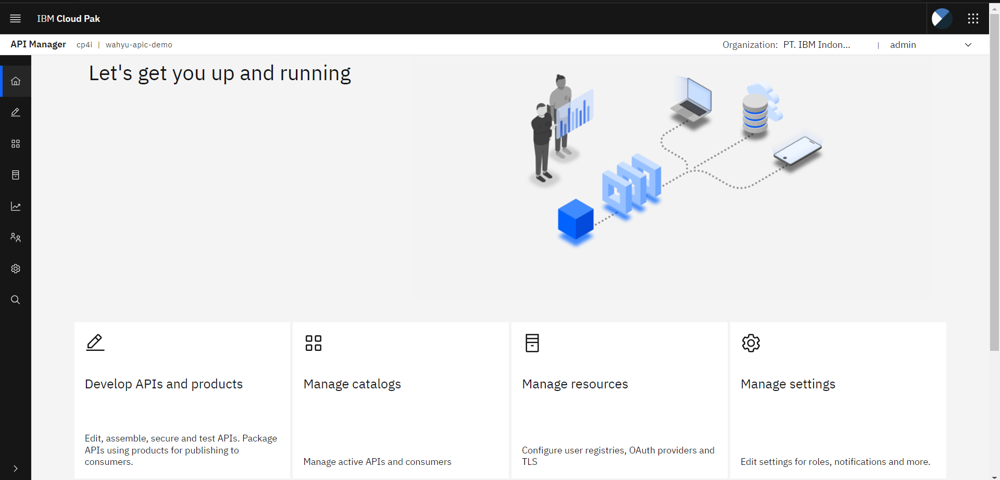

# Konfigurasi standart API Connect
Ketika anda masuk ke API Connect, anda belum bisa memakainya secara full. Hal ini dikarenakan diperlukannya konfigurasi pada **IBM API Connect**. 

1. Pada halaman list instance, klik pada instance **API Management Administration**

2. Anda akan masuk ke halaman login API Connect. Pilih login dengan **Common Services User Registry**

3. Anda akan masuk ke halaman **Cloud Manager Administration**

4. Pilih menu **Provider Organizations** dan klik **Add -> Create Organization**

5. Dalam menu **Create Provider Organizations**, isi field yang disediakan
    ~~~
    Title:  PT.IBM Indonesia
    User registry: Common Service User Registry
    Type Of User: Existing
    Username: Admin
    ~~~

6. Tampilan ketika berhasil membuat perusahaan atau organisasi.

7. Kembali ke halaman instance **CP4I** dan klik **API Management**

8. Login kembali menggunakan **Common Services User Registry**

9. Anda akan masuk ke halaman API Connect yang fitur-fitur nya siap untuk di demonstrasikan

### Selamat Anda berhasil mengkonfigurasikan IBM API Connect dan IBM API Connect siap dipakai