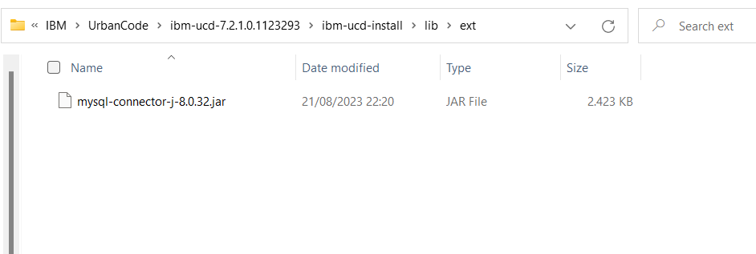
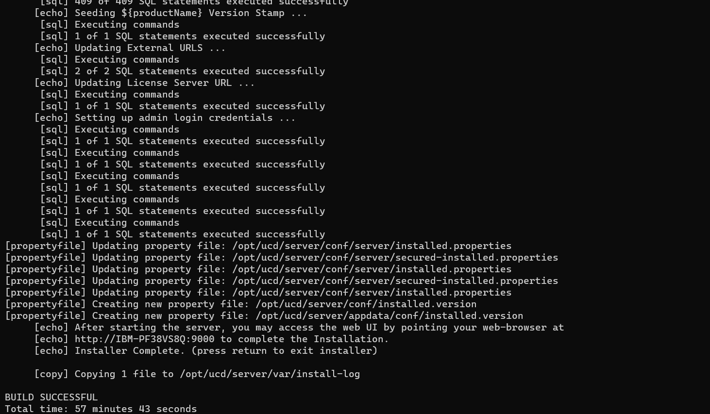

# Lab Urban Code
Dokumen ini menjelaskan bagaimana melakukan installasi urbancode secara manual step by step dengan platform ubuntu untuk standart keperluan demo ke client.
#

## System Requirement
1. Download [UrbanCode](https://www.ibm.com/support/fixcentral/swg/downloadFixes?parent=ibm%2FRational&product=ibm/Rational/IBM+UrbanCode+Deploy&release=All&platform=All&function=fixId&fixids=7.2.1.0-IBM-UrbanCode-Deploy&includeRequisites=1&includeSupersedes=0&downloadMethod=http&source=dbluesearch&mhsrc=ibmsearch_a&mhq=urbancode+deploy+7&login=true)
atau download disini untuk [urbancode server](https://cdn.mig.id/share/urban-code/ibm-ucd-7.2.1.0.1123293.zip) dan untuk [smartcloud integration](https://cdn.mig.id/share/urban-code/ibm-ucd-7.2.1.0.1123293.zip)
2. Ubuntu 22.04.2 LTS
3. Mysql Database
3. [Library Jar](https://cdn.mig.id/share/urban-code/MySqlJdbcDriver.zip) untuk koneksi ke JDBC
4. [Install UrbanCode Agent](UrbanCodeAgentInstallation.md)

## Installasi
1. Extract File zip Urban Code server. File biasanya bernama dengan inisial **ibm-ucd-***
2. Karena kita akan menggunakan database Mysql, persiapkan jar jdbc untuk koneksi kesana. Anda dapat langsung download langsung [disini](https://cdn.mig.id/share/urban-code/MySqlJdbcDriver.zip).
3. Buka folder hasil ekstraksi UCD, masuk ke path **lib/ext**. Taruh file jdbc jar-nya disana

Jar ini akan digunakan untuk melakukan koneksi ke database mysql anda
3. Masuk ke folder ucd dan jalankan file *install-server.sh*. 
4. Setelah menjalankan, beberapa pertanyaan akan muncul. Berikut dokumentasi dan configurasi untuk pertanyaan2 tersebut.
-------------------------------------------
```Enter the directory of the server to upgrade or install. Default [/opt/ucd/server]:```

Untuk value ini, kita akan ikuti secara default.

```Enter the home directory for the JRE/JDK that the new server will use. Default []: /usr/lib/jvm/java-8-openjdk-amd64```

Untuk value ini saya menggunakan path jre saya. Setelah pertanyaan diatas, anda akan dimunculkan persetujuan untuk license.

``` Where should the server store application data such as logs, plugins, and keystores? Where should the server store application data such as logs, plugins, and keystores? For every node in the HA cluster, this location must be the same, must be accessible, and must have the proper permissions. [Default: /opt/ucd/server/appdata]```

Kita ikuti path untuk menyimpan data pendukung didalam root dari ucd.

```What host name will users access the Web UI at? (For high availability servers, specify the host name of the load balancer, not the computer that hosts the server.) [Default: IBM-PF38VS8Q.]```

Berikut merupakan hostname untuk akses ke web ui nya. Kita biarkan default. Setelah ini, anda akan memasukkan segala detail tentang koneksi ke database. Dan proses installasi akan dilakukan.

