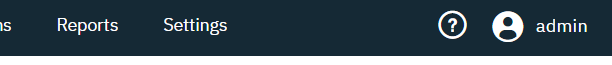
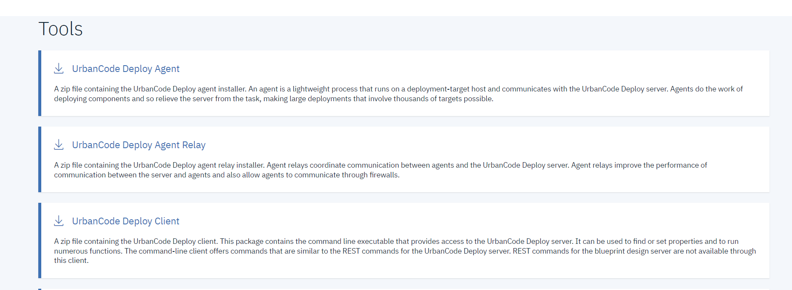
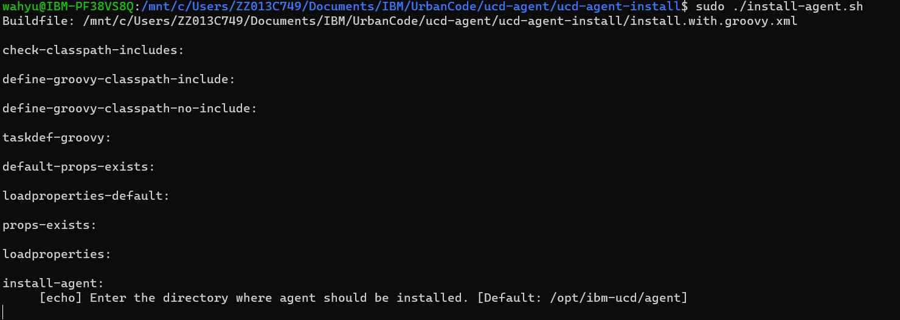
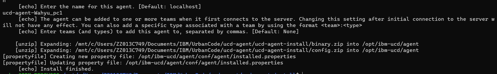
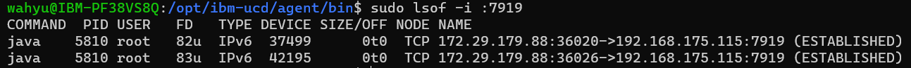
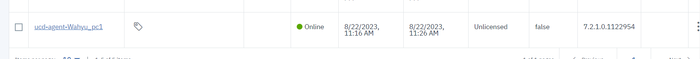

# Installasi Urban Code Agent

## Requirement
1. Urban Code Deploy sudah terinstall
2. Sistem Operasi Windows, Linux, atau AIX

## Langkah Installasi
1. Download Urban Code Agent. UrbanCode Agent dapat di-download di halaman UrbanCode Deploy. Klik Tombol "?" dibagian menu. Pilih menu **Tools**.

2. Anda akan di-*redirect* ke halaman tools dan pilih tools **UrbanCode Agent Deploy**.

3. Download dan extract.
4. Pada tutorial ini penulis akan menggunakan sistem operasi Linux untuk installasinya. Masuk ke hasil extraksi, execute file install-agent.sh (untuk windows: install-agent.bat)

5. Berikut Pertanyaan yang perlu diperhatikan

```Enter the directory where agent should be installed. [Default: /opt/ibm-ucd/agent]```
Tempat installasi agent, penulis akan menggunakan default value

```Please enter the home directory of the JRE/JDK used to run this agent. [Default: /usr/lib/jvm/java-8-openjdk-amd64] /usr/lib/jvm/java-8-openjdk-amd64```
Tempat installasi Java
6. Untuk sisa pertanyaannya bisa dijawab sesuai keadaan. Pada tahap ini anda akan sukses menginstall UrbanCode Deploy Agent

7. Masuk ke tempat installasi agent anda. dan masuk ke directory bin.
8. jalankan command **sudo ./agent start**
9. Cek pada port 7919 atau pada port tempat socket wss berjalan

10. Lihat pada halaman UCD. pada menu resources -> agents. IBM UrbanCode Agent Berhasil Di-install
